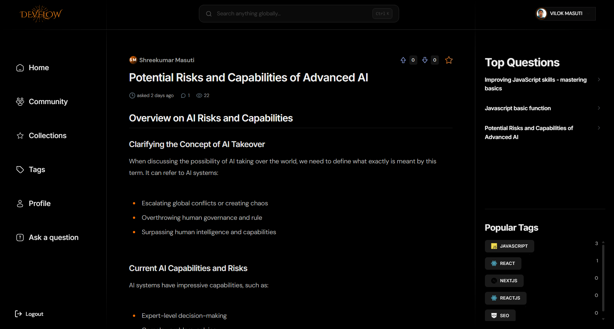
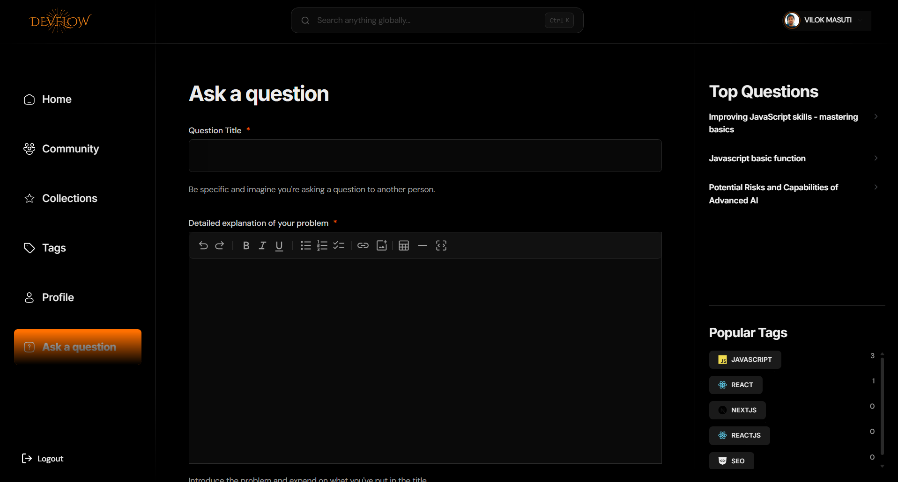
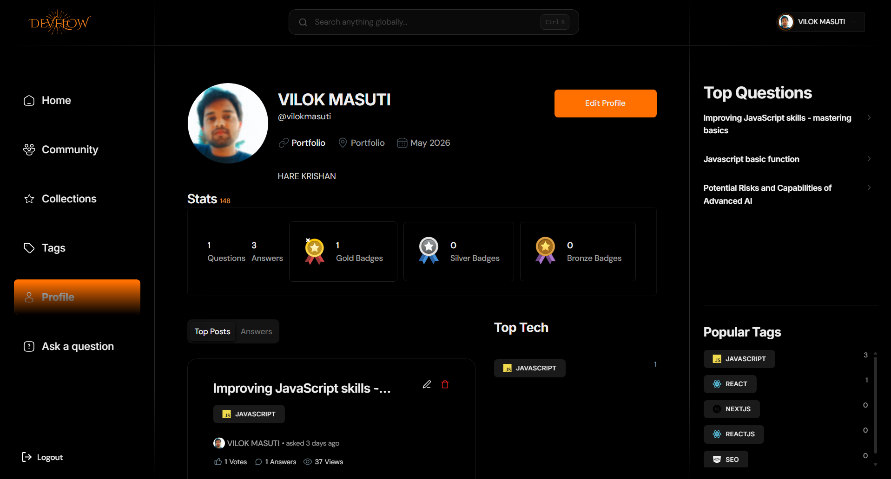
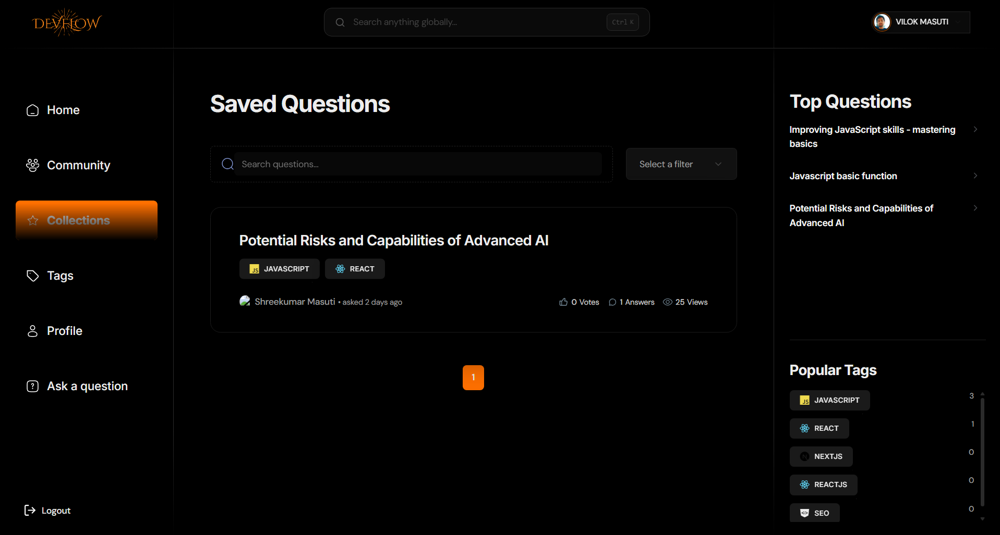

<p align="center">
  
</p>

<h1 align="center">DevFlow</h1>

<p align="center">
  <strong>A full-stack developer community platform inspired by Stack Overflow, enhanced with AI-powered workflows, gamification, and modern Next.js architecture.</strong>
</p>

<p align="center">
  Ask questions, post answers, discover developers, explore tags, save collections, get AI help, and grow with a community-first experience.
</p>

<p align="center">
  <a href="https://v-flow-alpha.vercel.app/"></a>
  <a href="#"></a>
  <a href="#"></a>
</p>

---

## Badges

<p align="center">
  
  
  
  
  
  
  
  
  
</p>

---

## Overview

**DevFlow** is a production-style, full-stack Q&A platform for developers.

Built with the latest **Next.js App Router** patterns, it combines classic developer community features with modern enhancements like:

- **AI-generated answers**
- **AI-enhanced question writing**
- **rich markdown support**
- **gamification and badges**
- **recommendations**
- **collections and bookmarks**
- **global search**
- **developer profiles**
- **job discovery**

This project also explores advanced rendering and performance strategies including:

- **SSG**
- **ISR**
- **SSR**
- **PPR**
- **server functions**
- **caching**
- **revalidation**

---

## Live Demo

 **Production URL:**
[https://v-flow-alpha.vercel.app/](https://v-flow-alpha.vercel.app/)

---

## Screenshots

> Add your screenshots into `public/screenshots/` with these names for the images below to work.

### Home Page
<p align="center">
  
</p>

### Question Details
<p align="center">
  
</p>

### Ask Question
<p align="center">
  
</p>

### User Profile
<p align="center">
  
</p>

### Collections / Saved Questions
<p align="center">
  
</p>

---

## Feature Highlights

<table>
  <tr>
    <td width="33%">
      <h3> AI Assistance</h3>
      <p>Generate answers with AI and enhance user questions into cleaner, more detailed, better-structured posts.</p>
    </td>
    <td width="33%">
      <h3> Smart Developer Experience</h3>
      <p>Rich markdown support, code blocks, pagination, filtering, sorting, and clean interaction flows across the platform.</p>
    </td>
    <td width="33%">
      <h3> Gamification</h3>
      <p>Badges, reputation, engagement tracking, and community-driven interaction designed to reward meaningful participation.</p>
    </td>
  </tr>
  <tr>
    <td width="33%">
      <h3> Authentication</h3>
      <p>Secure login and user management with Auth.js / NextAuth using Email, Google, and GitHub providers.</p>
    </td>
    <td width="33%">
      <h3> Discovery</h3>
      <p>Explore tags, recommended content, popular questions, community members, and global search results.</p>
    </td>
    <td width="33%">
      <h3> Performance</h3>
      <p>Built with modern Next.js rendering strategies and production-ready architecture for fast, scalable experiences.</p>
    </td>
  </tr>
</table>

---

## Core Features

### Authentication
- Email / Password authentication
- Google OAuth
- GitHub OAuth
- Protected routes and session handling

### Questions & Answers
- Ask programming questions
- Post answers
- Edit and delete questions/answers
- Upvote and downvote content
- Rich markdown/MDX support
- Safe rendering for code blocks and formatted content

### AI Features
- AI answer generation
- AI question enhancement
- markdown sanitization for unstable AI output
- fallback handling for invalid code fences like `N/A`, `undefined`, or empty fences

### User Experience
- Home feed with filters, search, and pagination
- Answer sorting and filtering
- Bookmarking / collections
- User profiles with badges and activity
- View tracking
- Global search
- Recommendations
- Tags and tag detail pages
- Job search page
- Responsive design

---

## Tech Stack

### Frontend
- **Next.js**
- **React**
- **TypeScript**
- **Tailwind CSS**
- **ShadCN UI**

### Backend / Data
- **MongoDB**
- **Mongoose**
- **Server Actions / Route Handlers**

### Validation / Forms
- **Zod**
- **React Hook Form**

### Authentication
- **NextAuth / Auth.js**

### AI
- **AI SDK**
- **Groq**
- **OpenAI-compatible workflows**

---

## Architecture Notes

This project focuses heavily on clean architecture and modern full-stack patterns:

- reusable UI components
- centralized route constants
- validation schemas
- server-first data fetching
- metadata and SEO support
- markdown sanitization pipeline
- scalable folder structure
- strong separation of concerns

---

## Folder Structure

```txt

├── 📁 app
│   ├── 📁 (auth)
│   │   ├── 📁 sign-in
│   │   │   └── 📄 page.tsx
│   │   ├── 📁 sign-up
│   │   │   └── 📄 page.tsx
│   │   └── 📄 layout.tsx
│   ├── 📁 (root)
│   │   ├── 📁 ask-question
│   │   │   ├── 📄 loading.tsx
│   │   │   └── 📄 page.tsx
│   │   ├── 📁 collection
│   │   │   ├── 📄 error.tsx
│   │   │   ├── 📄 loading.tsx
│   │   │   └── 📄 page.tsx
│   │   ├── 📁 community
│   │   │   ├── 📄 error.tsx
│   │   │   ├── 📄 loading.tsx
│   │   │   └── 📄 page.tsx
│   │   ├── 📁 profile
│   │   │   ├── 📁 [id]
│   │   │   │   ├── 📄 loading.tsx
│   │   │   │   └── 📄 page.tsx
│   │   │   └── 📁 edit
│   │   │       └── 📄 page.tsx
│   │   ├── 📁 question
│   │   │   ├── 📁 [id]
│   │   │   │   ├── 📁 edit
│   │   │   │   │   └── 📄 page.tsx
│   │   │   │   ├── 📄 loading.tsx
│   │   │   │   └── 📄 page.tsx
│   │   │   └── 📄 view.tsx
│   │   ├── 📁 tags
│   │   │   ├── 📁 [id]
│   │   │   │   ├── 📄 loading.tsx
│   │   │   │   └── 📄 page.tsx
│   │   │   ├── 📄 error.tsx
│   │   │   ├── 📄 loading.tsx
│   │   │   └── 📄 page.tsx
│   │   ├── 📄 error.tsx
│   │   ├── 📄 layout.tsx
│   │   ├── 📄 loading.tsx
│   │   └── 📄 page.tsx
│   ├── 📁 api
│   │   ├── 📁 accounts
│   │   │   ├── 📁 [id]
│   │   │   │   └── 📄 route.ts
│   │   │   ├── 📁 provider
│   │   │   │   └── 📄 route.ts
│   │   │   └── 📄 routes.ts
│   │   ├── 📁 ai
│   │   │   ├── 📁 answers
│   │   │   │   └── 📄 route.ts
│   │   │   └── 📁 question
│   │   │       └── 📄 route.ts
│   │   ├── 📁 auth
│   │   │   ├── 📁 [...nextauth]
│   │   │   │   └── 📄 route.ts
│   │   │   └── 📁 signin-with-oauth
│   │   │       └── 📄 route.ts
│   │   └── 📁 users
│   │       ├── 📁 [id]
│   │       │   └── 📄 route.ts
│   │       ├── 📁 email
│   │       │   └── 📄 route.ts
│   │       └── 📄 route.ts
│   ├── 📁 fonts
│   │   ├── 📄 CabinetGrotesk-Variable.ttf
│   │   ├── 📄 ClashDisplay-Variable.ttf
│   │   ├── 📄 InterVF.ttf
│   │   ├── 📄 Satoshi-Variable.ttf
│   │   ├── 📄 Satoshi-VariableItalic.ttf
│   │   └── 📄 SpaceGroteskVF.ttf
│   ├── 📄 favicon.ico
│   ├── 🎨 globals.css
│   └── 📄 layout.tsx
├── 📁 components
│   ├── 📁 Nav
│   │   ├── 📁 SideBar
│   │   │   ├── 📄 LeftNav.tsx
│   │   │   └── 📄 RightNav.tsx
│   │   ├── 📄 Index.tsx
│   │   ├── 📄 MobileNav.tsx
│   │   ├── 📄 NavLinks.tsx
│   │   └── 📄 Theme.tsx
│   ├── 📁 answers
│   │   └── 📄 AllAnswers.tsx
│   ├── 📁 auth
│   │   ├── 📄 AuthForm.tsx
│   │   └── 📄 SocialAuthForm.tsx
│   ├── 📁 cards
│   │   ├── 📄 AnswerCard.tsx
│   │   ├── 📄 QuestionCard.tsx
│   │   ├── 📄 TagCard.tsx
│   │   └── 📄 UserCard.tsx
│   ├── 📁 editar
│   │   ├── 📄 Preview.tsx
│   │   ├── 🎨 dark-editor.css
│   │   ├── 📄 index.tsx
│   │   └── 📄 question.mdx
│   ├── 📁 error
│   │   └── 📄 RouteError.tsx
│   ├── 📁 filters
│   │   ├── 📄 CommonFilter.tsx
│   │   ├── 📄 GlobalFilter.tsx
│   │   └── 📄 HomeFilters.tsx
│   ├── 📁 froms
│   │   ├── 📄 AnswerForm.tsx
│   │   ├── 📄 ProfileForm.tsx
│   │   └── 📄 QuestionForm.tsx
│   ├── 📁 lens
│   │   └── 📄 LenisProvider.jsx
│   ├── 📁 loaders
│   │   └── 📄 PageSkeleton.tsx
│   ├── 📁 questions
│   │   └── 📄 SaveQuestion.tsx
│   ├── 📁 search
│   │   ├── 📄 GlobalResult.tsx
│   │   ├── 📄 GobalSearch.tsx
│   │   └── 📄 LocalSearch.tsx
│   ├── 📁 ui
│   │   ├── 📄 DataRenderer.tsx
│   │   ├── 📄 accordion.tsx
│   │   ├── 📄 alert-dialog.tsx
│   │   ├── 📄 alert.tsx
│   │   ├── 📄 animated-button.tsx
│   │   ├── 📄 aspect-ratio.tsx
│   │   ├── 📄 avatar.tsx
│   │   ├── 📄 badge.tsx
│   │   ├── 📄 breadcrumb.tsx
│   │   ├── 📄 button-group.tsx
│   │   ├── 📄 button.tsx
│   │   ├── 📄 calendar.tsx
│   │   ├── 📄 card.tsx
│   │   ├── 📄 carousel.tsx
│   │   ├── 📄 chart.tsx
│   │   ├── 📄 checkbox.tsx
│   │   ├── 📄 collapsible.tsx
│   │   ├── 📄 command.tsx
│   │   ├── 📄 context-menu.tsx
│   │   ├── 📄 corner-button.tsx
│   │   ├── 📄 creepy-button.tsx
│   │   ├── 📄 dialog.tsx
│   │   ├── 📄 drawer.tsx
│   │   ├── 📄 dropdown-menu.tsx
│   │   ├── 📄 empty.tsx
│   │   ├── 📄 encrypted-text.tsx
│   │   ├── 📄 field.tsx
│   │   ├── 📄 flip-fade-text.tsx
│   │   ├── 📄 form.tsx
│   │   ├── 📄 hover-card.tsx
│   │   ├── 📄 input-group.tsx
│   │   ├── 📄 input-otp.tsx
│   │   ├── 📄 input.tsx
│   │   ├── 📄 item.tsx
│   │   ├── 📄 kbd.tsx
│   │   ├── 📄 kinetic-text-loader.tsx
│   │   ├── 📄 label.tsx
│   │   ├── 📄 line-hover-link.tsx
│   │   ├── 📄 menubar.tsx
│   │   ├── 📄 navigation-menu.tsx
│   │   ├── 📄 pagination.tsx
│   │   ├── 📄 pop-button.tsx
│   │   ├── 📄 popover.tsx
│   │   ├── 📄 progress.tsx
│   │   ├── 📄 radio-group.tsx
│   │   ├── 📄 resizable.tsx
│   │   ├── 📄 scroll-area.tsx
│   │   ├── 📄 select.tsx
│   │   ├── 📄 separator.tsx
│   │   ├── 📄 sheet.tsx
│   │   ├── 📄 sidebar.tsx
│   │   ├── 📄 skeleton.tsx
│   │   ├── 📄 slider.tsx
│   │   ├── 📄 sonner.tsx
│   │   ├── 📄 spinner.tsx
│   │   ├── 📄 switch.tsx
│   │   ├── 📄 table.tsx
│   │   ├── 📄 tabs.tsx
│   │   ├── 📄 textarea.tsx
│   │   ├── 📄 toggle-group.tsx
│   │   ├── 📄 toggle.tsx
│   │   └── 📄 tooltip.tsx
│   ├── 📁 user
│   │   ├── 📄 EditDeleteAction.tsx
│   │   ├── 📄 ProfileLink.tsx
│   │   └── 📄 Stats.tsx
│   ├── 📁 votes
│   │   └── 📄 Votes.tsx
│   ├── 📄 Metric.tsx
│   ├── 📄 Pagination.tsx
│   ├── 📄 UserAvatar.tsx
│   └── 📄 UserChip.tsx
├── 📁 constants
│   ├── 📄 Filter.ts
│   ├── 📄 index.ts
│   ├── 📄 interactions.ts
│   ├── 📄 routes.ts
│   ├── 📄 states.ts
│   └── 📄 techMap.tsx
├── 📁 database
│   ├── 📄 account.model.ts
│   ├── 📄 answer.model.ts
│   ├── 📄 collection.model.ts
│   ├── 📄 interaction.model.ts
│   ├── 📄 question.model.ts
│   ├── 📄 tag-question.model.ts
│   ├── 📄 tag.model.ts
│   ├── 📄 user.model.ts
│   └── 📄 vote.model.ts
├── 📁 hooks
│   └── 📄 use-mobile.ts
├── 📁 lib
│   ├── 📁 actions
│   │   ├── 📄 answer.action.ts
│   │   ├── 📄 auth.actions.ts
│   │   ├── 📄 collection.action.ts
│   │   ├── 📄 general.action.ts
│   │   ├── 📄 interaction.ts
│   │   ├── 📄 question.action.ts
│   │   ├── 📄 tag.actions.ts
│   │   ├── 📄 user.action.ts
│   │   └── 📄 vote.action.ts
│   ├── 📁 handlers
│   │   ├── 📄 actions.ts
│   │   ├── 📄 error.ts
│   │   └── 📄 fetch.ts
│   ├── 📄 api.ts
│   ├── 📄 http-errors.ts
│   ├── 📄 logger.ts
│   ├── 📄 markdownSafety.ts
│   ├── 📄 mongoose.ts
│   ├── 📄 sanitise.ts
│   ├── 📄 url.ts
│   ├── 📄 utils.ts
│   └── 📄 validations.ts
├── 📁 public
│   ├── 📁 icons
│   │   ├── 🖼️ account.svg
│   │   ├── 🖼️ arrow-left.svg
│   │   ├── 🖼️ arrow-right.svg
│   │   ├── 🖼️ arrow-up-right.svg
│   │   ├── 🖼️ au.svg
│   │   ├── 🖼️ avatar.svg
│   │   ├── 🖼️ bronze-medal.svg
│   │   ├── 🖼️ calendar.svg
│   │   ├── 🖼️ carbon-location.svg
│   │   ├── 🖼️ chevron-down.svg
│   │   ├── 🖼️ chevron-right.svg
│   │   ├── 🖼️ clock-2.svg
│   │   ├── 🖼️ clock.svg
│   │   ├── 🖼️ close.svg
│   │   ├── 🖼️ computer.svg
│   │   ├── 🖼️ currency-dollar-circle.svg
│   │   ├── 🖼️ downvote.svg
│   │   ├── 🖼️ downvoted.svg
│   │   ├── 🖼️ edit.svg
│   │   ├── 🖼️ eye.svg
│   │   ├── 🖼️ github.svg
│   │   ├── 🖼️ gold-medal.svg
│   │   ├── 🖼️ google.svg
│   │   ├── 🖼️ hamburger.svg
│   │   ├── 🖼️ home.svg
│   │   ├── 🖼️ job-search.svg
│   │   ├── 🖼️ like.svg
│   │   ├── 🖼️ link.svg
│   │   ├── 🖼️ location.svg
│   │   ├── 🖼️ message.svg
│   │   ├── 🖼️ mingcute-down-line.svg
│   │   ├── 🖼️ moon.svg
│   │   ├── 🖼️ question.svg
│   │   ├── 🖼️ search.svg
│   │   ├── 🖼️ sign-up.svg
│   │   ├── 🖼️ silver-medal.svg
│   │   ├── 🖼️ star-filled.svg
│   │   ├── 🖼️ star-red.svg
│   │   ├── 🖼️ star.svg
│   │   ├── 🖼️ stars.svg
│   │   ├── 🖼️ suitcase.svg
│   │   ├── 🖼️ sun.svg
│   │   ├── 🖼️ tag.svg
│   │   ├── 🖼️ trash.svg
│   │   ├── 🖼️ upvote.svg
│   │   ├── 🖼️ upvoted.svg
│   │   ├── 🖼️ user.svg
│   │   └── 🖼️ users.svg
│   ├── 📁 images
│   │   ├── 🖼️ auth-dark.png
│   │   ├── 🖼️ auth-light.png
│   │   ├── 🖼️ dark-error.png
│   │   ├── 🖼️ dark-illustration.png
│   │   ├── 🖼️ default-logo.svg
│   │   ├── 🖼️ light-error.png
│   │   ├── 🖼️ light-illustration.png
│   │   ├── 🖼️ logo-dark.svg
│   │   ├── 🖼️ logo-light.svg
│   │   ├── 🖼️ logo.png
│   │   └── 🖼️ site-logo.svg
│   ├── 🖼️ ask-question.png
│   ├── 🖼️ collections.png
│   ├── 🖼️ homepage.png
│   ├── 🖼️ logo.png
│   ├── 🖼️ og-image.png
│   ├── 🖼️ profile.png
│   └── 🖼️ question-details.png
├── 📁 types
│   ├── 📄 action.d.ts
│   ├── 📄 bcryptjs.d.ts
│   └── 📄 global.d.ts
├── ⚙️ .gitignore
├── ⚙️ .prettierignore
├── ⚙️ .prettierrc
├── 📝 README.md
├── 📄 auth.ts
├── ⚙️ components.json
├── 📄 eslint.config.mjs
├── 📄 next.config.ts
├── ⚙️ package-lock.json
├── ⚙️ package.json
├── 📄 postcss.config.mjs
├── 📄 proxy.ts
└── ⚙️ tsconfig.json

```

---

## Getting Started

### Prerequisites

Make sure you have installed:

- **Git**
- **Node.js**
- **npm**

---

## Installation

### 1. Clone the repository

```bash
git clone https://github.com/JavaScript-Mastery-Pro/devflow-v2-record.git
cd devflow-v2-record
```

### 2. Install dependencies

```bash
npm install
```

---

## Environment Variables

Create a `.env.local` file in the root of the project:

```env
# Database
MONGODB_URI=

# AI
GROQ_API_KEY=
OPENAI_API_KEY=

# Rapid API
NEXT_PUBLIC_RAPID_API_KEY=

# Auth
AUTH_GOOGLE_ID=
AUTH_GOOGLE_SECRET=
AUTH_GITHUB_ID=
AUTH_GITHUB_SECRET=
AUTH_SECRET=

# App URLs
NEXTAUTH_URL=http://localhost:3000
NEXT_PUBLIC_SITE_URL=http://localhost:3000
NEXT_PUBLIC_API_BASE_URL=http://localhost:3000/api
NEXT_PUBLIC_SERVER_URL=http://localhost:3000

# Editor / integrations
NEXT_PUBLIC_TINY_EDITOR_API_KEY=

# Environment
NODE_ENV=development
```

Replace the placeholders with your own credentials.

---

## Run Locally

```bash
npm run dev
```

Then open:

```txt
http://localhost:3000
```

---

## Production Deployment

When deploying to **Vercel**, make sure production environment variables use your real domain instead of localhost:

```env
NEXTAUTH_URL=https://v-flow-alpha.vercel.app
NEXT_PUBLIC_SITE_URL=https://v-flow-alpha.vercel.app
NEXT_PUBLIC_API_BASE_URL=https://v-flow-alpha.vercel.app/api
```

This is required for:

- auth callbacks
- metadata
- Open Graph images
- social previews
- dynamic route previews

---

## SEO / Open Graph

For best link previews:

- keep your app logo in `public/logo.png`
- use a dedicated banner image in `public/og-image.png`
- recommended OG size: **1200 × 630**

This improves previews on:

- GitHub links
- Discord
- Twitter / X
- LinkedIn
- Facebook

---

## Why This Project Stands Out

- production-style full-stack architecture
- modern App Router implementation
- developer-focused community product
- strong reusability and scalability
- practical AI integration
- polished UI and performance-first thinking

---

## Roadmap

- dynamic Open Graph image generation
- notifications
- real-time updates
- better recommendation engine
- richer reputation system
- advanced moderation tools

---

## Contributing

Contributions are welcome.

1. Fork the repository
2. Create a new branch
3. Make your changes
4. Commit and push
5. Open a pull request

---

## Support

If you get stuck, find a bug, or need help understanding the project, feel free to ask for support through your developer community or project discussion channels.

---

## License

This project is for learning, portfolio, and demonstration purposes unless a separate license is added.

---

## Author

Built with passion for developers, community, and modern full-stack engineering.

<p align="center">
  
</p>
